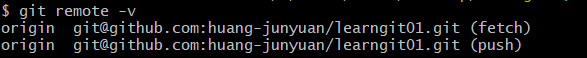
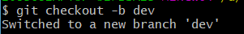

# Git学习

### 简介

#### 安装

安装完成后，还需要最后一步设置，在命令行输入：

```markdown
$ git config --global user.name "Your Name"
$ git config --global user.email "email@example.com"
```

注意`git config`命令的`--global`参数，用了这个参数，表示你这台机器上所有的Git仓库都会使用这个配置，当然也可以对某个仓库指定不同的用户名和Email地址。


#### 创建版本库


git分为3个区域，工作区、暂存区、版本库(本地)。
**工作区**包括git已经管理的文件区域和新增以及修改的文件区域
**暂存区**：把工作区中的部分或者全部已经确认需要保存的文件提交至暂存区，先保存一下，如果直接确认可以提交到本地仓库中；如果暂时不能做决定可以暂时先放到暂存区，等可以做决定了，再进行下一步操作。
**版本库**：将某一个历史节点的保存文件列表当做是一个版本。


什么是版本库呢？版本库又名仓库，英文名**repository**，你可以简单理解成一个目录（即文件夹），这个目录里面的所有文件都可以被Git管理起来，每个文件的修改、删除，Git都能跟踪，以便任何时刻都可以追踪历史，或者在将来某个时刻可以“还原”。

```markdown
mkdir file
cd file
pwd
```

`mkdir`为创建版本库（文件夹），`cd`为进入该文件夹，pwd用于显示当前目录


第二步，通过`git init`命令把这个目录变成Git可以管理的仓库：

```markdown
$ git init
Initialized empty Git repository in D:/Users/20836/Desktop/learngit/file/.git/
```


瞬间Git就把仓库建好了，而且告诉你是一个空的仓库（empty Git repository），细心的读者可以发现当前目录下多了一个`.git`的目录，这个目录是Git来跟踪管理版本库的，没事千万不要手动修改这个目录里面的文件，不然改乱了，就把Git仓库给破坏了。

如果你没有看到`.git`目录，那是因为这个目录默认是隐藏的，用`ls -ah`命令就可以看见。

没有加`-ah`参数显示其他文件以及文件夹

```markdown
ls -ah #该命令用于显示目录
```


### 时光机穿梭

在版本库中成功地添加并提交了一个readme.txt文件，readme.txt文件的内容如下：

```markdown
Git is a distributed version control system.
Git is free software.
```

现在，运行`git status`命令看看结果：

```markdown
$ git status
On branch master

No commits yet

Untracked files:
  (use "git add <file>..." to include in what will be committed)
        readme.txt

nothing added to commit but untracked files present (use "git add" to track)
```

`git status`命令可以让我们时刻掌握仓库当前的状态，上面的命令输出说明readme.txt还没有被跟踪

`git diff`命令用来显示文件的变化

```markdown
$ git diff
diff --git a/readme.txt b/readme.txt
index b4f8dde..013b5bc 100644
--- a/readme.txt
+++ b/readme.txt
@@ -1,3 +1,2 @@
 Git is a distributed version control system.
-Git is free software.
-Modified once.
\ No newline at end of file
+Git is free software.
\ No newline at end of file

```


使用`git add 文件名`来把文件添加到暂存区

```markdown
$ git add readme.txt
```

再次使用`git status`查看情况


使用`git commit -m "说明"`来提交到版本库中

```markdown
$ git commit -m "增加了两行"
[master (root-commit) ca70a0f] 增加了两行
 1 file changed, 3 insertions(+)
 create mode 100644 readme.txt
```


提交后，我们再用`git status`命令看看仓库的当前状态：


#### 版本回退

回顾一下`readme.txt`文件一共有几个版本被提交到Git仓库里了：

版本1：wrote a readme file

```markdown
Git is a version control system.
Git is free software.
```

版本2：add distributed

```markdown
Git is a distributed version control system.
Git is free software.
```

版本3：append GPL

```markdown
Git is a distributed version control system.
Git is free software distributed under the GPL.
```

使用`git log`命令查看历史记录


`git log`命令显示从最近到最远的提交日志，我们可以看到3次提交，最近的一次是`append GPL`，上一次是`add distributed`，最早的一次是`wrote a readme file`。


使用`git log`后，git一直停留在log模式，这时只需要按q键即可退出


如果嫌输出信息太多，看得眼花缭乱的，可以试试加上`--pretty=oneline`参数：


需要友情提示的是，你看到的一大串类似`42ddcc...`的是`commit id`（版本号），和SVN不一样，Git的`commit id`不是1，2，3……递增的数字，而是一个SHA1计算出来的一个非常大的数字，用十六进制表示，而且你看到的`commit id`和我的肯定不一样，以你自己的为准。为什么`commit id`需要用这么一大串数字表示呢？因为Git是分布式的版本控制系统，后面我们还要研究多人在同一个版本库里工作，如果大家都用1，2，3……作为版本号，那肯定就冲突了。


现在我们启动时光穿梭机，准备把`readme.txt`回退到上一个版本，也就是`add distributed`的那个版本，怎么做呢？

首先，Git必须知道当前版本是哪个版本，在Git中，用`HEAD`表示当前版本，也就是最新的提交`42ddcc...`，上一个版本就是`HEAD^`，上上一个版本就是`HEAD^^`，当然往上100个版本写100个`^`比较容易数不过来，所以写成`HEAD~100`。

现在，我们要把当前版本`append GPL`回退到上一个版本`add distributed`，就可以使用`git reset`命令：

```markdown
$ git reset --hard HEAD^
HEAD is now at a26d7a5 add distributed
```


`--hard`参数有啥意义？这个后面再讲，现在你先放心使用

使用`cat 文件名`命令看看`readme.txt`的内容是不是版本`add distributed`：

```markdown
$ cat readme.txt
Git is a distributed version control system.
Git is free software.
```


果然被还原了。

还可以继续回退到上一个版本`wrote a readme file`，不过且慢，让我们用`git log`再看看现在版本库的状态：


最新的那个版本`append GPL`已经看不到了！好比你从21世纪坐时光穿梭机来到了19世纪，想再回去已经回不去了，肿么办？

办法其实还是有的，只要上面的命令行窗口还没有被关掉，你就可以顺着往上找啊找啊，找到那个`append GPL`的`commit id`是`42ddcc...`，于是就可以指定回到未来的某个版本：

```markdown
$ git reset --hard 42ddcc
HEAD is now at 42ddcc7 append GPL
```


版本号没必要写全，前几位就可以了，Git会自动去找。当然也不能只写前一两位，因为Git可能会找到多个版本号，就无法确定是哪一个了。

Git的版本回退速度非常快，因为Git在内部有个指向当前版本的`HEAD`指针，当你回退版本的时候，Git仅仅是把HEAD从指向`append GPL`：


改为指向`add distributed`：


然后顺便把工作区的文件更新了。所以你让`HEAD`指向哪个版本号，你就把当前版本定位在哪。

现在，你回退到了某个版本，关掉了电脑，第二天早上就后悔了，想恢复到新版本怎么办？找不到新版本的`commit id`怎么办？

在Git中，总是有后悔药可以吃的。当你用`$ git reset --hard HEAD^`回退到`add distributed`版本时，再想恢复到`append GPL`，就必须找到`append GPL`的commit id。Git提供了一个命令`git reflog`用来记录你的每一次命令：

```markdown
$ git reflog
42ddcc7 (HEAD -> master) HEAD@{0}: reset: moving to 42ddcc
a26d7a5 HEAD@{1}: reset: moving to HEAD^
42ddcc7 (HEAD -> master) HEAD@{2}: reset: moving to 42ddcc
a26d7a5 HEAD@{3}: reset: moving to HEAD^
42ddcc7 (HEAD -> master) HEAD@{4}: commit: append GPL
a26d7a5 HEAD@{5}: commit: add distributed
10bfb1f HEAD@{6}: commit (initial): wrote a readme file
```


终于舒了口气，从输出可知，`append GPL`的commit id是`42ddcc7`，现在，你又可以乘坐时光机回到未来了。

#### 工作区和暂存区

工作区（Working Directory）

就是你在电脑里能看到的目录，比如我的`learngit`文件夹就是一个工作区：

版本库（Repository）

工作区有一个隐藏目录`.git`，这个不算工作区，而是Git的版本库。

Git的版本库里存了很多东西，其中最重要的就是称为stage（或者叫index）的暂存区，还有Git为我们自动创建的第一个分支`master`，以及指向`master`的一个指针叫`HEAD`。


前面讲了我们把文件往Git版本库里添加的时候，是分两步执行的：

第一步是用`git add`把文件添加进去，实际上就是把文件修改添加到暂存区；

第二步是用`git commit`提交更改，实际上就是把暂存区的所有内容提交到当前分支。

因为我们创建Git版本库时，Git自动为我们创建了唯一一个`master`分支，所以，现在，`git commit`就是往`master`分支上提交更改。

你可以简单理解为，需要提交的文件修改通通放到暂存区，然后，一次性提交暂存区的所有修改。


#### 管理修改

为什么Git比其他版本控制系统设计得优秀，因为Git跟踪并管理的是修改，而非文件。什么是修改？比如你新增了一行，这就是一个修改，删除了一行，也是一个修改，更改了某些字符，也是一个修改，删了一些又加了一些，也是一个修改，甚至创建一个新文件，也算一个修改。


用`git diff HEAD -- readme.txt`命令可以查看工作区和版本库里面最新版本的区别：


#### 撤销修改

#####丢弃工作区中的修改


使用`restore`命令丢弃工作区中的修改


##### 丢弃暂存区中的修改


使用`git restore --staged 文件名`来丢弃刚刚存入暂存区中的内容，但是工作区中的内容不变

####删除文件

在Git中，删除也是一个修改操作，我们实战一下，先添加一个新文件`test.txt`到Git并且提交：


一般情况下，你通常直接在文件管理器中把没用的文件删了，或者用`rm`命令删了：

```markdown
$ rm test.txt
```

这个时候，Git知道你删除了文件，因此，工作区和版本库就不一致了，`git status`命令会立刻告诉你哪些文件被删除了：


现在你有两个选择，一是确实要从版本库中删除该文件，那就用命令`git rm`或者`git add`删掉，并且`git commit`：


另一种情况是删错了，因为版本库里还有呢，所以可以很轻松地把误删的文件恢复到最新版本：

```markdown
$ git checkout -- test.txt
```

`git checkout`其实是用版本库里的版本替换工作区的版本，无论工作区是修改还是删除，都可以“一键还原”。

注意：从来没有被添加到版本库就被删除的文件，是无法恢复的！


### 远程仓库

Git是分布式版本控制系统，同一个Git仓库，可以分布到不同的机器上。怎么分布呢？最早，肯定只有一台机器有一个原始版本库，此后，别的机器可以“克隆”这个原始版本库，而且每台机器的版本库其实都是一样的，并没有主次之分。

找一台电脑充当服务器的角色，每天24小时开机，其他每个人都从这个“服务器”仓库克隆一份到自己的电脑上，并且各自把各自的提交推送到服务器仓库里，也从服务器仓库中拉取别人的提交。

完全可以自己搭建一台运行Git的服务器，不过现阶段，为了学Git先搭个服务器绝对是小题大作。好在这个世界上有个叫[GitHub](https://github.com/)的神奇的网站，从名字就可以看出，这个网站就是提供Git仓库托管服务的，所以，只要注册一个GitHub账号，就可以免费获得Git远程仓库。

由于你的本地Git仓库和GitHub仓库之间的传输是通过SSH加密的，所以，需要一点设置：

第1步：创建SSH Key。在用户主目录下，看看有没有.ssh目录，如果有，再看看这个目录下有没有`id_rsa`和`id_rsa.pub`这两个文件，如果已经有了，可直接跳到下一步。如果没有，打开Shell（Windows下打开Git Bash），创建SSH Key：

```markdown
$ ssh-keygen -t rsa -C "youremail@example.com"
```

你需要把邮件地址换成你自己的邮件地址，然后一路回车，使用默认值即可，由于这个Key也不是用于军事目的，所以也无需设置密码。

如果一切顺利的话，可以在用户主目录里找到`.ssh`目录，里面有`id_rsa`和`id_rsa.pub`两个文件，这两个就是SSH Key的秘钥对，`id_rsa`是私钥，不能泄露出去，`id_rsa.pub`是公钥，可以放心地告诉任何人。

我的地址

```markdown
C:\Users\20836\.ssh
```


####添加远程库

目前，在GitHub上的这个`learngit`仓库还是空的，GitHub告诉我们，可以从这个仓库克隆出新的仓库，也可以把一个已有的本地仓库与之关联，然后，把本地仓库的内容推送到GitHub仓库。

现在，我们根据GitHub的提示，在本地的`learngit`仓库下运行命令：

```markdown
$ git remote add origin https://github.com/huang-junyuan/learngit01.git
```

添加后，远程库的名字就是`origin`，这是Git默认的叫法，也可以改成别的，但是`origin`这个名字一看就知道是远程库。


下一步，就可以把本地库的所有内容推送到远程库上：

```markdown
git push -u origin master
```


把本地库的内容推送到远程，用`git push`命令，实际上是把当前分支`master`推送到远程。

由于远程库是空的，我们第一次推送`master`分支时，加上了`-u`参数，Git不但会把本地的`master`分支内容推送的远程新的`master`分支，还会把本地的`master`分支和远程的`master`分支关联起来，在以后的推送或者拉取时就可以简化命令。

从现在起，只要本地作了提交，就可以通过命令：

```markdown
git push origin master
```

把本地`master`分支的最新修改推送至GitHub，现在，你就拥有了真正的分布式版本库！


修改远程仓库的地址

```markdown
git remote set-url origin <remote-url>
```


仓库路径查询

```markdown
git remote -v
```




删除指定的远程仓库（根据名字）

```markdown
git remote rm <name>
```

此处的“删除”其实是解除了本地和远程的绑定关系，并不是物理上删除了远程库。远程库本身并没有任何改动。要真正删除远程库，需要登录到GitHub，在后台页面找到删除按钮再删除。


#### 从远程库克隆

现在，假设我们从零开发，那么最好的方式是先创建远程库，然后，从远程库克隆。

首先，登陆GitHub，创建一个新的仓库，名字叫`gitskills`：


用命令`git clone`克隆一个本地库：


注意把Git库的地址换成你自己的，然后进入`gitskills`目录看看，已经有`README.md`文件了：


使用`ls`命令查看当前版本库中的文件

如果有多个人协作开发，那么每个人各自从远程克隆一份就可以了。

你也许还注意到，GitHub给出的地址不止一个，还可以用`https://github.com/michaelliao/gitskills.git`这样的地址。实际上，Git支持多种协议，默认的`git://`使用ssh，但也可以使用`https`等其他协议。

使用`https`除了速度慢以外，还有个最大的麻烦是每次推送都必须输入口令，但是在某些只开放http端口的公司内部就无法使用`ssh`协议而只能用`https`。

`ssh`协议速度最快。


### 分支管理

#### 创建与合并分支

在[版本回退](https://www.liaoxuefeng.com/wiki/896043488029600/897013573512192)里，你已经知道，每次提交，Git都把它们串成一条时间线，这条时间线就是一个分支。截止到目前，只有一条时间线，在Git里，这个分支叫主分支，即`master`分支。`HEAD`严格来说不是指向提交，而是指向`master`，`master`才是指向提交的，所以，`HEAD`指向的就是当前分支。

一开始的时候，`master`分支是一条线，Git用`master`指向最新的提交，再用`HEAD`指向`master`，就能确定当前分支，以及当前分支的提交点：


每次提交，`master`分支都会向前移动一步，这样，随着你不断提交，`master`分支的线也越来越长。

当我们创建新的分支，例如`dev`时，Git新建了一个指针叫`dev`，指向`master`相同的提交，再把`HEAD`指向`dev`，就表示当前分支在`dev`上：


从现在开始，对工作区的修改和提交就是针对`dev`分支了，比如新提交一次后，`dev`指针往前移动一步，而`master`指针不变：


假如我们在`dev`上的工作完成了，就可以把`dev`合并到`master`上。Git怎么合并呢？最简单的方法，就是直接把`master`指向`dev`的当前提交，就完成了合并：


合并完分支后，甚至可以删除`dev`分支。删除`dev`分支就是把`dev`指针给删掉，删掉后，我们就剩下了一条`master`分支：


首先，我们创建`dev`分支，然后切换到`dev`分支：

```markdown
git checkout -b dev
```



`git checkout`命令加上`-b`参数表示创建并切换，相当于以下两条命令：

```markdown
$ git branch dev
$ git checkout dev
Switched to branch 'dev'
```

然后，用`git branch`命令查看当前分支：

```
$ git branch
* dev
  master
```

`git branch`命令会列出所有分支，当前分支前面会标一个`*`号。


然后，我们就可以在`dev`分支上正常提交，比如对`readme.txt`做个修改，加上一行：

```
Creating a new branch is quick.
```

然后提交：

```
$ git add readme.txt 
$ git commit -m "branch test"
[dev b17d20e] branch test
 1 file changed, 1 insertion(+)
```

现在，`dev`分支的工作完成，我们就可以切换回`master`分支：

```
$ git checkout master
Switched to branch 'master'
```

切换回`master`分支后，再查看一个`readme.txt`文件，刚才添加的内容不见了！因为那个提交是在`dev`分支上，而`master`分支此刻的提交点并没有变：


现在，我们把`dev`分支的工作成果合并到`master`分支上：

```markdown
git merge dev
```


`git merge`命令用于合并指定分支到当前分支。合并后，再查看`readme.txt`的内容，就可以看到，和`dev`分支的最新提交是完全一样的。

注意到上面的`Fast-forward`信息，Git告诉我们，这次合并是“快进模式”，也就是直接把`master`指向`dev`的当前提交，所以合并速度非常快。

当然，也不是每次合并都能`Fast-forward`，我们后面会讲其他方式的合并。


#### 解决冲突

