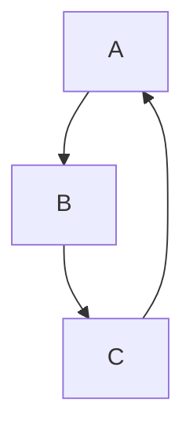
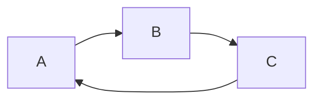
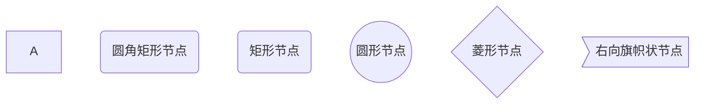
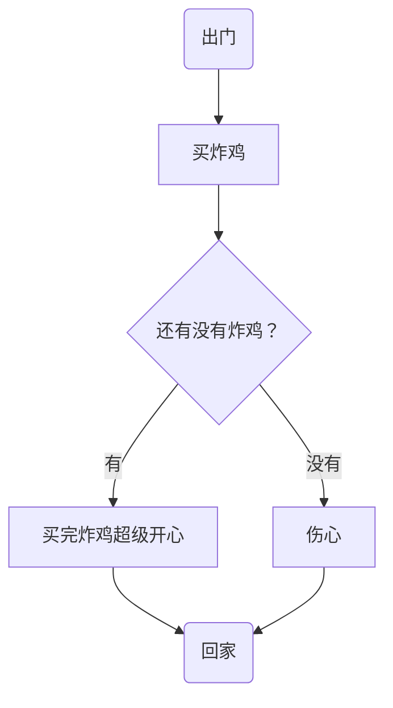
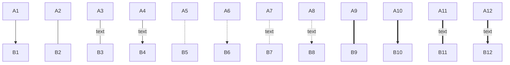
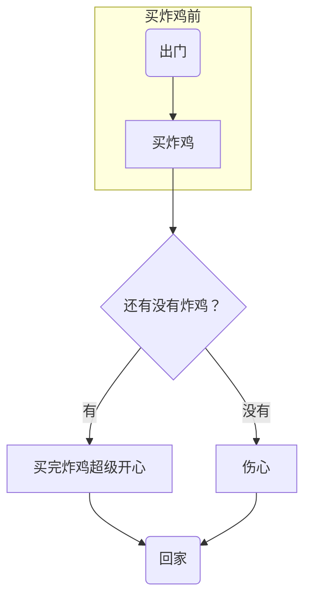
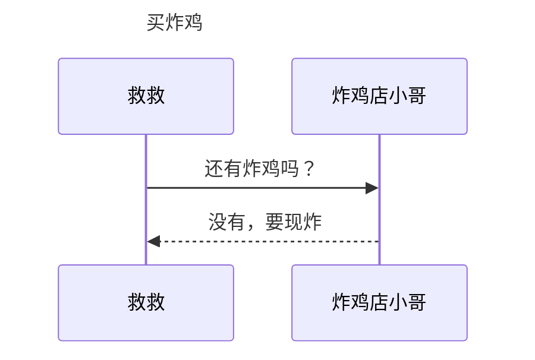
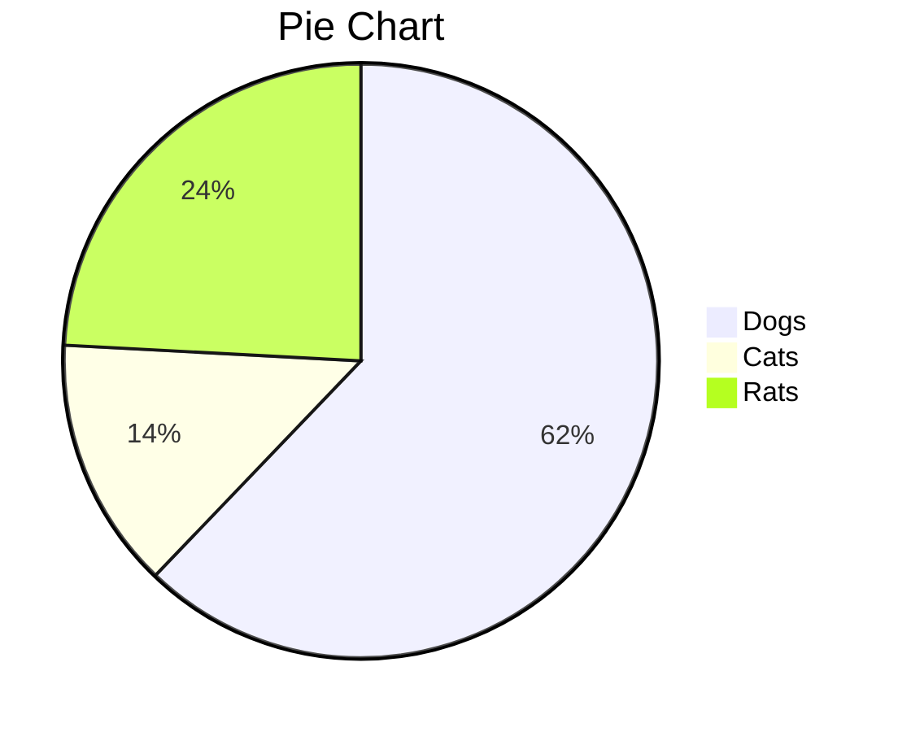

# MarkDown基础

```markd
# 标题名字（中间有空格，井号的个数代表标题的级数）
```


## 文字

### 删除线

```mark
~~文字~~  （使用两个波浪号）
```

~~文字~~


### 斜体

```mark
*文字*  （使用一个星号）
```

*文字*


### 加粗

~~~mark
**文字**  （使用两个星号）
~~~

**文字**


### 斜体 + 加粗

```mark
***文字***  （使用两个星号）
```

***文字***


### 下划线

```mark
使用HTML语法 <u>文字</u>

或者使用快捷键Ctrl + u

快捷键在格式选项中
```

<u>文字</u>

<u>文字</u>


### 高亮（需要勾选扩展语法）

```mark
==文字==  （两个等号）
```

==文字==


### 下标（需要勾选扩展语法）

```mark
水 H~2~0  （使用波浪号）
```

H~2~0


### 上标（需要勾选扩展语法）

```mark
面积 m^2^  （使用小尖尖）
```

m^2^


### 表格

```mark
使用|来分隔不同的单元格，使用-来分隔表头和其他行

| name | price |
| 和 - 两侧需要至少一个空格（最左侧和最右侧）

```


| name          | price |
| ------------- | ----- |
| fried chicken | 19    |


### 引用

```mark
>文字 （右尖括号）
在一个引用内再打一个右尖括号>即可嵌套引用
```

> 文字
>
> > 嵌套引用


### 列表

#### 无序列表：符号 + 空格

```mark
* 文字
+ 文字
- 文字
```

* 文字

+ 文字

- 文字


####有序列表：数字 + . +空格

```mark
1. 文字

注：数字的序列并不会影响生成的列表序列
但仍推荐按照自然顺序（1,2,3……）编写
```

1. 第一

3. 第三


### 代码

#### 代码块

```mark
​```语言名称
如```markdown
```

```c++
int main()
{
    return 0;
}
```


#### 行内代码

```mark
`文字或者符号`
`java`
```

`java`


### 分割线

```mark
可以在一行中使用三个或者更多的*、-或_来添加分割线
***
---
___
```


***


### 跳转

#### 外部跳转--超链接

```mark
格式为[link text][link]

[帮助文档](https://www.bilibili.com/video/BV1d741147k2?from=search&seid=6821074297242406492)
```


[Markdown保姆级教程之基础篇（Typora使用教程）_哔哩哔哩_bilibili](https://www.bilibili.com/video/BV1d741147k2?from=search&seid=6821074297242406492)

([百度一下，你就知道 (baidu.com)](https://www.baidu.com/))


####内部跳转--本文件内跳转

```mark
格式为[link text](#要去的目的地--标题)

[我想跳转](#分割线)
```

[内部跳转](#分割线)


#### 自动链接

```mark
使用<>包括的URL或邮箱地址会被自动转换为超链接

<https://www.baidu.com>
```

<https://www.baidu.com>


### 图片

```mark

```

#### 网上的图片

```mark


直接把图片的网址复制粘贴进来即可，会自动生成代码格式
```


#### 本地图片

```mark

在同一个文件夹里（用相对路径）
或者直接拷贝
```


在`文件`，`偏好设置`中可以设置文件的存储路径


##利用Markdown画图

---

markdown画图也是轻量级的，功能并不全。

Mermaid是一个用于画流程图、状态图、时序图、甘特图的库，使用JS进行本地渲染，广泛集成于许多Markdown编辑器中。Mermaid作为一个使用JS渲染的库，生成的不是一个“图片”，而是一段HTML代码。

### 流程图（graph）

#### 概述

```mark
需要先```mermaid

graph 方向描述
	图片中其他语句...
```

关键字graph表示一个流程图的开始，同时需要指定该图的方向。

其中“方向描述”为：

| 用词 | 含义     |
| ---- | -------- |
| TB   | 从上到下 |
| BT   | 从下到上 |
| RL   | 从右到左 |
| LR   | 从左到右 |

> T = TOP, B = BOTTOM, L = LEFT, R = RIGHT

最常用的布局方向是TB，LR。

```mark
graph TB
	A-->B
	B-->C
	C-->A
```





```markdown
graph LR;
	A-->B;
	B-->C;
	C-->A;
```



#### 流程图常用符号及含义

##### 节点形状

| 表述       | 说明           | 含义                                                 |
| ---------- | -------------- | ---------------------------------------------------- |
| id[文字]   | 矩形节点       | 表示过程，也就是整个流程中的一个环节                 |
| id(文字)   | 圆角矩形节点   | 表示开始和结束                                       |
| id((文字)) | 圆形节点       | 表示连接。为避免流程过长或有交叉，可将流程切开。成对 |
| id{文字}   | 菱形节点       | 表示决策、判断                                       |
| id>文字]   | 右向旗帜状节点 |                                                      |

```markdown
文字若不加英文的双引号，则只能是中英文，不能是符号
需要使用符号的时候需要加双引号
```


**单向箭头线段**：表示流程进行的方向

> id即为节点的唯一标识，A~F是当前节点名字，类似于变量名，画图时便于引用
>
> 括号内是节点中要显示的文字，默认节点的名字和显示的文字都为A

```markdown
graph TB
	A
	B(圆角矩形节点)
	C(矩形节点)
	D((圆形节点))
	E{菱形节点}
	F>右向旗帜状节点]
```



```markdown
graph TB
	begin(出门) --> buy[买炸鸡]
	buy --> IsRemaining{"还有没有炸鸡？"}
	IsRemaining -->|有|happy[买完炸鸡超级开心] --> goback(回家)
	IsRemaining --没有--> sad["伤心"] --> goback
```



##### 连线

```markdown
graph TB
	A1-->B1
	A2---B2
	A3--text---B3
	A4--text-->B4
	A5-.-B5
	A6-.->B6
	A7-.text.-B7
	A8-.text.->B8
	A9===B9
	A10==>B10
	A11==text===B11
	A12==text==>B12
```



##### 子图表

使用以下语法添加子图表

```markdown
subgraph 子图表名称
	子图表中的描述语句
end
```


```markdown
graph TB
	begin(出门) --> buy[买炸鸡]
	buy --> IsRemaining{"还有没有炸鸡？"}
	IsRemaining -->|有|happy[买完炸鸡超级开心] --> goback(回家)
	IsRemaining --没有--> sad["伤心"] --> goback
```




### 序列图（sequence diagram）

#### 概述

```markdown
sequenceDiagram
	[参与者1][消息线][参与者2]:消息体
	  ...
```

> `sequenceDiagram`为每幅时序图的固定开头

```markdown
sequenceDiagram
	Title: 买炸鸡
	救救->>炸鸡店小哥: 还有炸鸡吗？
	炸鸡店小哥-->>救救: 没有，要现炸
```



#### 参与者（participant）

传统时序图概念中参与者有角色和类对象之分，但这里我们不做此区分，用参与者表示一切参与交互的事物，可以是人、类对象、系统等形式。中间竖直的线段从上至下表示时间的流逝。

```markdown
sequenceDiagram
	participant 参与者 1
	participant 参与者 2
	...
	participant 简称 as 参与者3 #该语法可以在接下来的描述中使用简称来代替参与者3
```

> `participant <参与者名称>`声明参与者，该语句次序即为参与者横向排列次序

#### 消息线

| 类型 | 描述                               |
| ---- | ---------------------------------- |
| ->   | 无箭头的实线                       |
| -->  | 无箭头的虚线                       |
| ->>  | 有箭头的实线（主动发出消息）       |
| -->> | 有箭头的虚线（响应）               |
| -x   | 末端为叉的实线，有箭头（表示异步） |
| --x  | 末端为叉的虚线，有箭头（表示异步） |


#### 处理中-激活框

从消息接收方的时间线上标记一小段时间，表示对消息进行处理的时间间隔。

在消息线末尾增加 `+` ,则消息接受者进入当前信息的“处理中”状态；

在消息线末尾增加 `-` ，则消息接受者离开当前消息的“处理中”状态。

```markdown
sequenceDiagram
	participant 99 as 救救
	participant seller as 炸鸡店小哥
	99 ->> seller: 还有炸鸡吗？
	seller -->> 99: 没有，要现炸。
	99 -x +seller: 给我炸！
	seller -->> -99: 您的炸鸡好了！
```


```mermaid
sequenceDiagram
	participant 99 as 救救
	participant seller as 炸鸡店小哥
	99 ->> seller: 还有炸鸡吗？
	seller -->> 99: 没有，要现炸。
	99 -x +seller: 给我炸！
	seller -->> -99: 您的炸鸡好了！
```


#### 注解

语法如下

```markdown
Note 位置表述 参与者：标注文字
```

其中位置表述可以为

| 表述     | 含义                       |
| -------- | -------------------------- |
| right of | 右侧                       |
| left of  | 左侧                       |
| over     | 在当中，可以横跨多个参与者 |

```markdown
sequenceDiagram
	participant 99 as 救救
	participant seller as 炸鸡店小哥
	Note over 99,seller : 热爱炸鸡
	Note left of 99 : 女
	Note right of seller : 男
	99 ->> seller: 还有炸鸡吗？
	seller -->> 99: 没有，要现炸。
	99 -> +seller : 给我炸！
	seller -->> -99: 您的炸鸡好了！
```


```mermaid
sequenceDiagram
	participant 99 as 救救
	participant seller as 炸鸡店小哥
	Note over 99,seller : 热爱炸鸡
	Note left of 99 : 女
	Note right of seller : 男
	99 ->> seller: 还有炸鸡吗？
	seller -->> 99: 没有，要现炸。
	99 -> +seller : 给我炸！
	seller -->> -99: 您的炸鸡好了！
```


#### 循环（loop）

在条件满足时，重复发出消息序列。（相当于编程语言中的while语句。）

```markdown
sequenceDiagram
	participant 99 as 救救
	participant seller as 炸鸡店小哥
	
	99 ->> seller :还有炸鸡吗？
	seller -->> 99 :没有，要现炸。
	99 ->> + seller : 给我炸！
	loop 三分钟一次
		99 ->> seller : 我的炸鸡好了吗？
		seller -->> 99 : 正在炸
	end
	seller -->> -99:您的炸鸡好了！
```


```mermaid
sequenceDiagram
	participant 99 as 救救
	participant seller as 炸鸡店小哥
	
	99 ->> seller :还有炸鸡吗？
	seller -->> 99 :没有，要现炸。
	99 ->> + seller : 给我炸！
	loop 三分钟一次
		99 ->> seller : 我的炸鸡好了吗？
		seller -->> 99 : 正在炸
	end
	seller -->> -99:您的炸鸡好了！
```

#### 选择（alt）

在多个条件中做出判断，每个条件将对应不同的消息序列。（相当于if及lese if语句。）

```markdown
sequenceDiagram
	participant 99 as 救救
	participant seller as 炸鸡店小哥
	99 ->> seller : 现在就多少只炸好的炸鸡？
	seller -->> 99 : 可卖的炸鸡数
	
	alt 可卖的炸鸡数 > 3
		99 ->> seller : 买三只！
	else 1 < 可卖的炸鸡数 < 3
		99 ->> seller : 有多少买多少
	else 可卖炸鸡数 < 1
		99 ->> seller : 那我明天再来
	end
	
	seller -->> 99 : 欢迎下次光临
```


```mermaid
sequenceDiagram
	participant 99 as 救救
	participant seller as 炸鸡店小哥
	99 ->> seller : 现在就多少只炸好的炸鸡？
	seller -->> 99 : 可卖的炸鸡数
	
	alt 可卖的炸鸡数 > 3
		99 ->> seller : 买三只！
	else 1 < 可卖的炸鸡数 < 3
		99 ->> seller : 有多少买多少
	else 可卖炸鸡数 < 1
		99 ->> seller : 那我明天再来
	end
	
	seller -->> 99 : 欢迎下次光临
```

#### 可选（opt）

在某条件满足时执行消息序列，否则不执行。相当于单个分支的if语句。

```markdown
```

```mermaid
sequenceDiagram
	participant 99 as 救救
	participant seller as 炸鸡店小哥
	99 ->> seller : 买炸鸡
	opt 全都卖完了
		seller -->> 99 : 下次再来
	end
```

#### 并行（Par）

将消息序列分成多个片段，这些片段并行执行。

```markdown
sequenceDiagram
	participant 99 as 救救
	participant seller as 炸鸡店小哥
	
	99 ->> seller : 一个炸鸡，一杯可乐！
	
	par 并行执行
		seller ->> seller : 装可乐
	and
		seller ->> seller : 炸炸鸡
	end
	
	seller -->> 99 : 您的炸鸡好了！
```

```mermaid
sequenceDiagram
	participant 99 as 救救
	participant seller as 炸鸡店小哥
	
	99 ->> seller : 一个炸鸡，一杯可乐！
	
	par 并行执行
		seller ->> seller : 装可乐
	and
		seller ->> seller : 炸炸鸡
	end
	
	seller -->> 99 : 您的炸鸡好了！
```


### 饼图（Pie）

```markdown
pie
	title Pie Chart
		"Dogs" : 386
		"Cats" : 85
		"Rats" : 150
```



